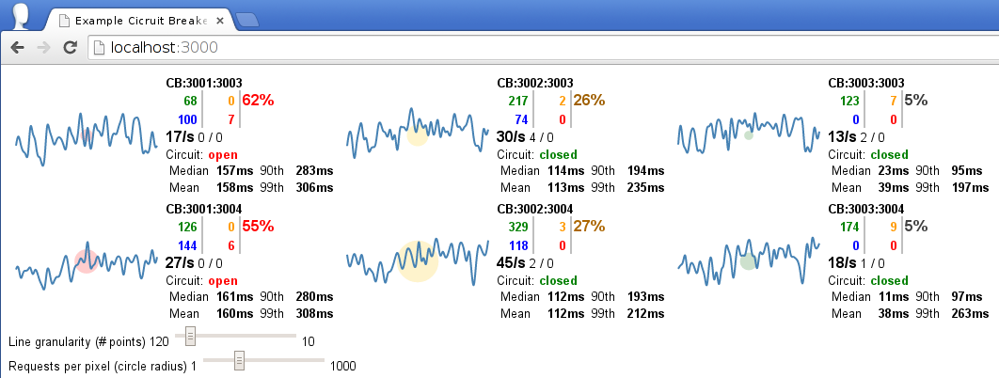

#What is it
This is a more complete example using the
[RequestCircuitBreaker](http://pablolb.github.io/promise-circuitbreaker/RequestCircuitBreaker.html).
It simulates a number of users making web requests to two `app` servers.
To render each page, the `app` server will in turn make several calls
to three `service` servers.

<pre>
[user]                 [app]                 [service]  
  |  ---(1 request)--->  | ---(N requests)---->  |
  |                      |                       |
  |                      | <--(N responses)----  |
  |  <---(1 response)--  |                       |
</pre>

The calls made from the `app` to the `service` servers are the ones which use
the circuit breakers.

Both `app` servers group the circuit breakers' data through a
[CBObserver](http://pablolb.github.io/promise-circuitbreaker/CBObserver.html) instance.
It then pushes the metrics to the `stats` server using
[socket.io-client](https://github.com/LearnBoost/socket.io-client) as it
was simple enough as a proof-or-concept.  The basic idea is that you might want to use
a different process to summarize and calculate the statistics, so as not to block node's event loop
in your app.

The `stats` server summarizes the circuit breakers' information through a
[CBStats](http://pablolb.github.io/promise-circuitbreaker/CBStats.html) instance.
It again uses [socket-io](https://github.com/LearnBoost/socket.io)
to communicate with the browser.

<pre>
[app]               [stats]                     [browser]
  |  ---(metrics)--->  |                            |
  |                    |                            |
  |                    |  ---(processed stats)--->  |
</pre>


The `service` processes simulate two types of problems, sick periods and maintenance
periods.  During the sick periods, their response is far greater than expected
and during maintenance periods, it will fail quickly with a 503 status code.  The
circuit breaker are configured to trip instantly on the 503 http status code error.

The `stats` service provides a web UI based on Netflix's
[Hystrix Dashboard](https://github.com/Netflix/Hystrix/wiki/Dashboard):



The layout, colors and what is represented is pretty much borrowed from them.

#Running the example
You will need to install the development dependencies:

```bash
git clone https://github.com/pablolb/promise-circuitbreaker
cd promise-circuitbreaker
npm install
```

The example uses the [cluster](http://nodejs.org/api/cluster.html) module to
fork all the processes.  It forks two `app` processes, three `service` processes,
one `stats` process and by default two `user` processes.

There is quite a lot of output to the console, and it can be quite
resource intensive.  You can lower the `--user-worker` and the `--users-per-worker`
and make the end-user requests less frequent by raising the `--users-min-sleep`
and the `--users-max-sleep` to make it less resource greedy.

<pre>
node example/app/ --help
usage: node example/app [options]


This example will spawn several node processes simulating two app servers, three backend services, one stats server, and a configurable amount of 'user workers' simulating end-user requests.

The app servers make requests to the three backend services through circuit breakers and push their metrics to the stats server, which has a monitoring web-UI.


-h, --help                 Print this help and exit
--user-workers             Number of childs to fork which simulate end-user requests (default: 2)
--users-per-worker         Number or users to simulate per worker child (default: 5)
--users-min-sleep          Minimum milliseconds to sleep before performing another request (default: 100)
--users-max-sleep          Maximum milliseconds to sleep before performing another request (default: 750)
--service-port-{1,2,3}     Port to listen on for the service number N (1,2,3) (defaults: 3001, 3002, 3003)
--app-port-{1,2}           Port to listen on for the app N (1,2) (defaults: 3003, 3004)
--stats-s2s-port           Port to listen for stats collection (default: 3005)
--stats-webui-port         Port where the stats server servers the web UI (default: 3000)
--globalagent-maxsockets   http.globalAgent.maxSockets value (default: 1000)
</pre>

While it is running, each process attempts to change the process title so you can identify
it can be easily identified in `top` or `ps`:

<pre>
$ ps aux | grep node
pablo    22130  0.7  0.4 676668 27496 pts/0    Sl+  21:41   0:00 node example/app/
pablo    22160  1.5  0.6 679956 39376 pts/0    Sl+  21:41   0:00 node (stats server)
pablo    22161  6.6  0.6 679632 40668 pts/0    Sl+  21:41   0:03 node (service:3001)
pablo    22163  9.3  0.9 681680 59240 pts/0    Sl+  21:41   0:04 node (service:3002)
pablo    22164  4.9  0.6 678608 39768 pts/0    Sl+  21:41   0:02 node (service:3003)
pablo    22167 14.5  1.1 989992 70948 pts/0    Sl+  21:41   0:06 node (app:3003)
pablo    22169 20.5  1.2 995188 77100 pts/0    Sl+  21:41   0:09 node (app:3004)
pablo    22170  4.7  0.7 979596 45956 pts/0    Sl+  21:41   0:02 node (user worker)
pablo    22172  5.3  0.7 978748 43460 pts/0    Sl+  21:41   0:02 node (user worker)
pablo    22378  0.0  0.0  11168  1080 pts/2    S+   21:42   0:00 grep node
</pre>

